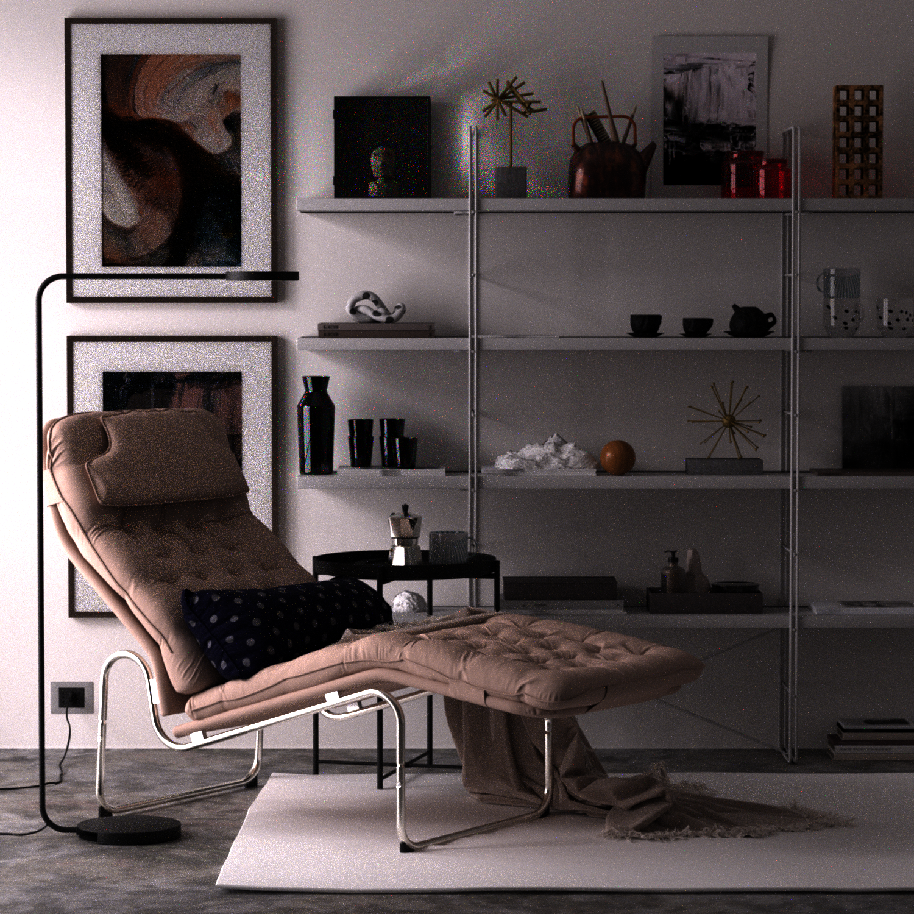
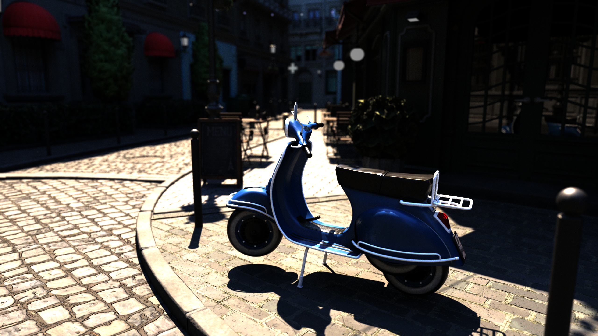
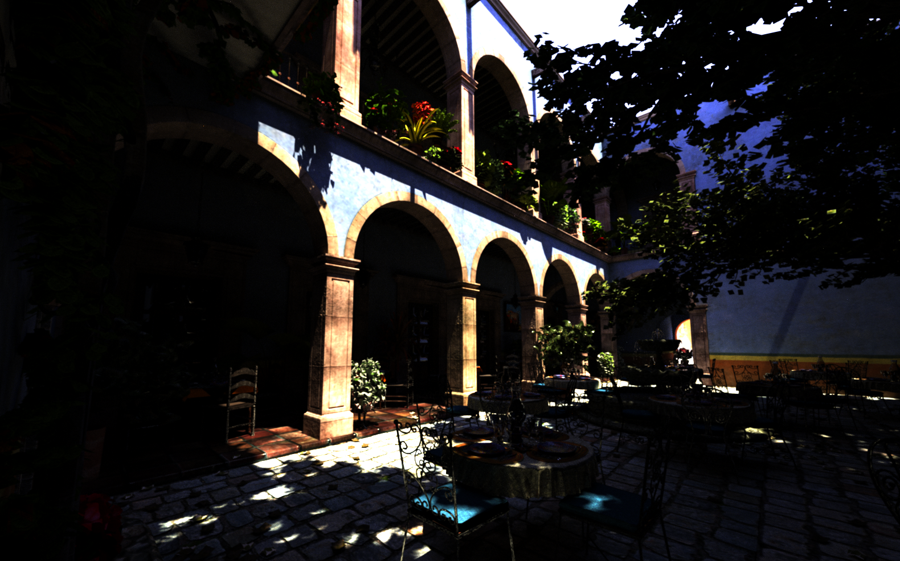
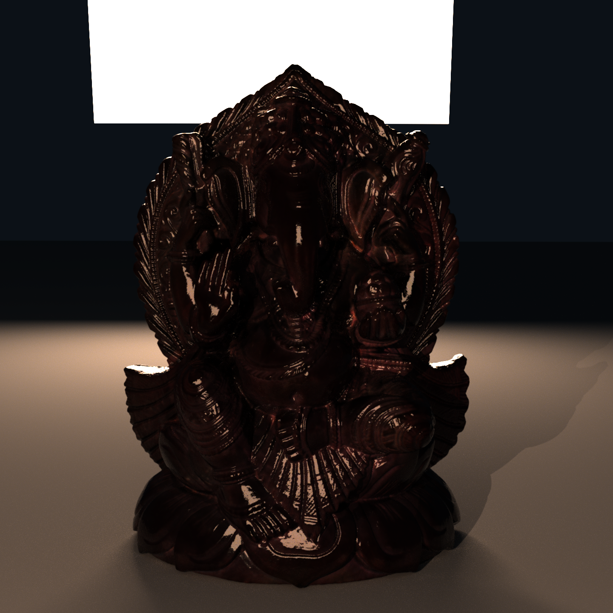
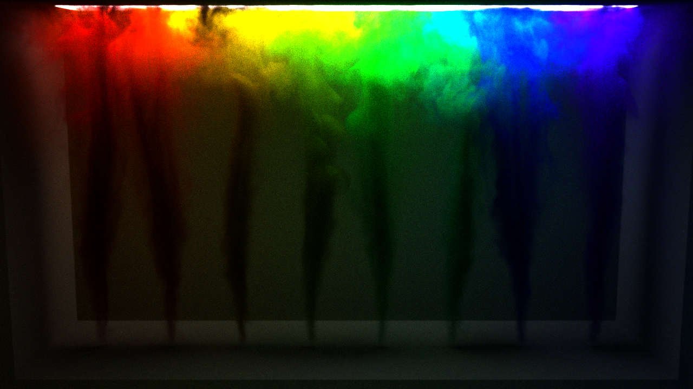

# Cray

## Description

Cray is a physically based raytracer written from scratch in Rust.

## Features

- Cameras
    - [x] Orthographic Camera
    - [x] Perspective Camera
- Film
    - [x] Rgb Film
    - [ ] GBuffer Film
- Shapes
    - [x] Spheres
    - [x] Triangle Mesh
    - [x] Bilinear Patch Mesh
    - [ ] Disks
    - [ ] Curves
    - [ ] SDFs
- Samplers
    - [x] Independent Sampler
    - [x] Stratified Sampler
    - [x] Halton Sampler
    - [ ] Sobol Sampler
    - [ ] Padded Sobol Sampler
    - [x] ZSobol Sampler
    - [ ] PMJ02BN Sampler
- BSDFs
    - [x] Diffuse
    - [x] Diffuse Transmission
    - [x] Conductor
    - [x] Coated Diffuse
    - [x] Coated Conductor
    - [x] Dielectric
    - [x] Thin Dielectric
    - [x] Normalized Fresnel
    - [ ] Measured BSDFs
    - [ ] Hair BSDF
    - [ ] Disney BSDF
- Textures
    - [x] Float Constant Texture
    - [x] Float Image Texture
    - [x] Float Mix Texture
    - [x] Float Direction Mix Texture
    - [x] Float Scaled Texture
    - [x] Spectrum Constant Texture
    - [x] Spectrum Image Texture
    - [x] Spectrum Mix Texture
    - [x] Spectrum Direction Mix Texture
    - [x] Spectrum Scaled Texture
    - [ ] Windy Texture
    - [ ] Wrinkled Texture
- Media
    - [x] Homogeneous Medium
    - [x] Grid Medium
    - [x] RGB Grid Medium
    - [ ] Cloud Medium
    - [ ] NanoVDB Medium
- Light Sources
    - [x] Point Light
    - [ ] Distant Light
    - [ ] Projection Light
    - [ ] Goniometric Light
    - [ ] Spot Light
    - [x] Diffuse Area Light
    - [x] Uniform Infinite Light
    - [x] Image Infinite Light
    - [x] Portal Image Infinite Light
- Light Samplers
    - [x] Uniform Light Sampler
    - [ ] Power Light Sampler
    - [ ] Exhaustive Light Sampler
    - [x] BVH Light Sampler

## Example Scenes

The above scenes can be found at the [pbrt-v4-scenes repo](https://github.com/mmp/pbrt-v4-scenes?tab=readme-ov-file).

## Acknowledgements

Cray is built primarily following the PBRT-v4 book from [pbrt.org](https://pbrt.org/).
